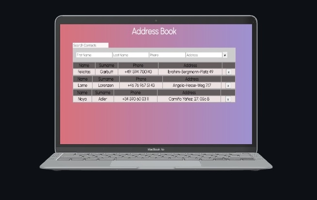

## Address-Book

This is a simple address book I worked on while I was learning JavaScript, HTML, CSS and jQuery.
It was my first project, back in October 2021, when I was applying to get into the Software Engineer Program at _CodeWorks_.
Looking back at it I realized how much I've learned in such short period of time and how excited I am to keep growing and learning new technologies!

## Screenshot

<p align="center">
  
</p>

## Getting Started

1. Clone the repo

   ```bash
   git clone https://github.com/braga-felipe/address-book
   ```

2. If you're using _VS Code_ you can right-click on the index.html file and select _Open with Live Server_

## Contacts won't be stored

The contacts you store in the address book are erased once you refresh the page, since I didn't add any database connection, as I still didn't know how to do it then.

Thanks for checking it out!
